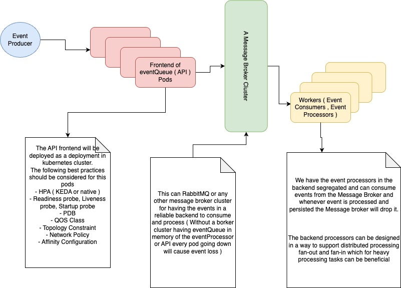

5- Write examples for deployments the API in kubernetes ( deployment, readinessProb, livenessProb, Service, PDB, QOS Class, Pod Topology Constraints, Network Policies, AffinityConfigurations )

# Event Queue API
This event queue system is only for **demo purpose**, showing code implementation and few concepts of having observability over a simple application. This architecture is not a production level architecture. The true architecture would be as follows which can be discussed.





## Features

- **Event Types Support**
  - Log events with level and message
  - Metric events with numerical values
  - Extensible event type system

- **High-Performance Architecture**
  - Asynchronous event processing with worker pool
  - Decoupled producer/consumer model
  - Configurable queue capacity for backpressure control using semaphore pattern to control go concurrency on worker processings

- **API Endpoints**
  - `POST /v1/events` - Submit new events to the queue
  - `GET /v1/stats` - Get current queue statistics
  - `GET /metrics` - Prometheus metrics endpoint
  - `POST /v1/tokens` - Getting JWT Token for authenticating yourself to /v1/events 

- **Comprehensive Validation**
  - Input validation

- **Robust Error Handling**
  - Standardized error responses
  - Detailed validation error messages
  - Proper HTTP status codes
- **Authentication**
  Admin user is able to create JWT token with admin username and password
  - have simple basic authenication for /v1/tokens path
  - have JWT authentication for /v1/events publishing

- **Rate Limiting**
  - Global rate limiting for overall API protection
  - Per-client rate limiting to prevent abuse
  - Configurable limits and burst allowances

- **Observability**
  - OpenTelemetry distributed tracing
  - Prometheus metrics for monitoring
  - Jaeger integration for trace visualization
  - Grafana dashboards for metrics visualization

- **Graceful Shutdown**
  - Proper resource cleanup on termination
  - Completion of in-flight request processing
  - Handling of queued events before shutdown

## Getting Started

### Prerequisites

- Go 1.20 or higher
- Make command
- Docker and Docker Compose for observability stack

### Installation

1. Clone the repository:
   ```bash
   git@github.com:kdask/behavox-tech-task-cybrarymin.git
   cd behavox-tech-task-cybrarymin
   ```

2. Build the application:
   
   ```bash
   $ make help
   $ make audit
   $ make build/api/dockerImage DOCKER_IMAGENAME=<repo-name>
   ```

### Running the Application

Run the application with default settings:
```bash
$ docker run -p 80:80 <IMAGE_NAME>:<TAG_NAME>

```
OR

```bash
# create .envrc to export arbitrary variables
$ vim .envrc
export LISTEN_ADDR="https://0.0.0.0:443"
export JWTKEY="XXXXXXXsomething"
export ADMINUSER="behavox-admin" # default admin
export ADMINPASS="behavox-pass" # default admin pass
export LOGLVL="debug"
$ source .envrc


## run the application
$ make run/api
```

With custom settings:

```bash
$ openssl req -x509 -newkey rsa:4096 -keyout /tmp/key.pem -out /tmp/cert.pem -sha256 -days 3650 -nodes -subj "/C=CA/ST=ON/L=Toronto/O=Behavox/OU=Devops/CN=*.behavox.com" 1>&2 2>/dev/null;

$ docker volume create processed-events

$ docker run -v /tmp/cert.pem:/certificates/cert.pem -v /tmp/key.pem:/certificates/key.pem -v processed-events.json:/etc/events.json -p 443:443 <IMAGE_NAME>:<TAG_NAME> \
  --log-level=debug \
  --jeager-host="host.docker.internal" \
  --cert=/certificates/cert.pem \
  --cert-key=/certificates/key.pem \
  --listen-addr=https://0.0.0.0:443 \
  --enable-rate-limit=true \
  --global-request-rate-limit=100 \
  --per-client-rate-limit=10 \
  --event-queue-size=1000 \
  --event-processor-file=/etc/events.json

```
OR
```bash
./bin/behavox-local-compatible \
  --log-level=debug \
  --listen-addr=http://localhost:8080 \
  --enable-rate-limit=true \
  --global-request-rate-limit=100 \
  --per-client-rate-limit=10 \
  --event-queue-size=1000 \
  --event-processor-file=/tmp/events.json
```

### Creating a Log Event

```bash
#### Get a JWT token ####
TOKEN=$(curl -k -X POST -u "$ADMINUSER:$ADMINPASS" https://localhost:443/v1/tokens | jq .result.token | tr -d '"')


#### Creating a Log event ####
curl -k -X POST https://localhost:443/v1/events \
  -H "Authorization: Bearer $TOKEN" \
  -H "Content-Type: application/json" \
  -d '{ "event": 
        { "event_type": "log",
          "event_id": "f47ac10b-58cc-4372-a567-0e02b2c3d479",
          "level": "error",
          "message": "Database connection failed"
        }
      }'
```

### Creating a Metric Event

```bash
#### Get a JWT token ####
TOKEN=$(curl -k -X POST -u "$ADMINUSER:$ADMINPASS" https://localhost:443/v1/tokens | jq .result.token | tr -d '"')

#### Create a metric event ####
curl -k -X POST https://localhost:443/v1/events \
  -H "Authorization: Bearer $TOKEN" \
  -H "Content-Type: application/json" \
  -d '{
    "event": {
      "event_type": "metric",
      "event_id": "f47ac10b-58cc-4372-a567-0e02b2c3d479",
      "value": 95.8
    }
  }'
```

### Getting Queue Statistics

```bash
curl -k -X GET https://localhost:443/v1/stats
```

## Configuration

| Flag | Description | Default |
|------|-------------|---------|
| `--log-level` | Logging level (debug, info, warn, error, fatal, panic, trace) | info |
| `--listen-addr` | Server listen address (with protocol) | https://0.0.0.0:443 |
| `--srv-read-timeout` | Server read timeout | 3s |
| `--srv-write-timeout` | Server write timeout | 3s |
| `--srv-idle-timeout` | Server idle connection timeout | 60s |
| `--cert` | TLS certificate path | /etc/ssl/cert.pem |
| `--cert-key` | TLS certificate key path | /etc/ssl/key.pem |
| `--enable-rate-limit` | Enable rate limiting | false |
| `--global-request-rate-limit` | Global requests per second limit | 25 |
| `--per-client-rate-limit` | Per-client requests per second limit | 2 |
| `--event-queue-size` | Maximum events in queue | 100 |
| `--event-processor-file` | Path for processed events JSON file | /tmp/events.json |
| `--jeager-host` | Jaeger server address | localhost |
| `--jeager-port` | Jaeger server port | 5317 |


**Github actions and workflows**
To avoid failure on github actions consider add the below secrets and environment variables in github "secrets and variables section"

secrets:
DOCKER_REGISTRY_USERNAME
DOCKER_REGISTRY_PASS

envs:
DOCKER_IMAGE_NAME


## License

[MIT License](LICENSE)

## Contributing

1. Fork the repository
2. Create your feature branch (`git checkout -b feature/amazing-feature`)
3. Commit your changes (`git commit -m 'Add some amazing feature'`)
4. Push to the branch (`git push origin feature/amazing-feature`)
5. Open a Pull Request